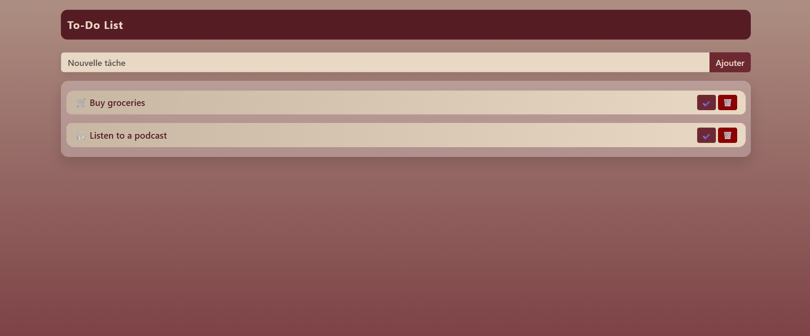

# 📝 Todo_Liste — Application To‑Do List en PHP & MySQL

Une application simple et fonctionnelle permettant de gérer des tâches quotidiennes. Développée en binôme par **Zouhair El Maazi** et **Soukaina kania**.

---

## 📘 1. Introduction

Cette plateforme permet de créer, afficher, compléter et supprimer des tâches à l’aide d’une interface intuitive. Le projet met en pratique :

* La manipulation du DOM avec PHP
* Le stockage de données avec MySQL
* Le design responsive grâce à CSS / Bootstrap

Elle a été pensée pour être **simple**, **rapide**, et **agréable visuellement**.

---

## 🛠️ 2. Technologies utilisées

| Technologie   | Rôle                          |
| ------------- | ----------------------------- |
| **PHP**       | Traitement côté serveur       |
| **MySQL**     | Gestion de la base de données |
| **HTML**      | Structure de la page          |
| **CSS**       | Design et mise en forme       |
| **Bootstrap** | Interface responsive          |

---

## ✨ 3. Fonctionnalités principales

* ➕ Ajouter une tâche
* ✔️ Marquer une tâche comme faite / non faite
* 🗑️ Supprimer une tâche
* 📱 Interface adaptée mobile
* 📂 Organisation simple des fichiers

---

## 📁 4. Structure du projet

```
/Todo-Liste/
├── front-end/
│    ├── style.css
├── screenshot/
│    ├── todolist.mp4
│    ├── Capture_decran_todolist.png
│    └── Capture_decran2_todolist.png
├── sql/
│    └── db.sql
├── README.md
└── index.php

## 🖼️ 6. Aperçu de l’application

### 🖥️ Vue Web



### 📱 Vue Mobile


### 🎥 Démonstration vidéo


---

## 🧪 7. Tests réalisés

| Fonctionnalité      | Résultat attendu        | Statut |
| ------------------- | ----------------------- | ------ |
| Ajout de tâche      | La tâche apparaît       | ✅      |
| Marquer comme faite | La tâche devient verte  | ✅      |
| Suppression         | La tâche disparaît      | ✅      |
| Responsive          | Bonne adaptation mobile | ✅      |

---

## 🚀 8. Améliorations possibles

* 🔐 Ajout d’un système d’authentification
* ⭐ Priorité des tâches
* 🔎 Barre de recherche
* ✉️ Notifications (email ou popup)
* 🌓 Mode sombre

---

## 📥 Installation

### 1️⃣ Importation de la base de données

* Ouvrir **phpMyAdmin**
* Importer le fichier : `sql/db.sql`

### 2️⃣ Installation du projet

* Placer le dossier dans : `htdocs/` (XAMPP)
* Exécuter dans le navigateur :

```
http://localhost/Todo_Liste
```

---

## 🎓 9. Conclusion

Ce projet nous a permis de renforcer nos compétences en :

* PHP & MySQL
* Git/GitHub (travail collaboratif)
* Structuration de projets web
* Responsive design

Il représente une base solide pour construire des applications plus avancées.

---

## ✍️ Auteurs

* **Soukaina Kania**
* **Zouhair El Maazi**

